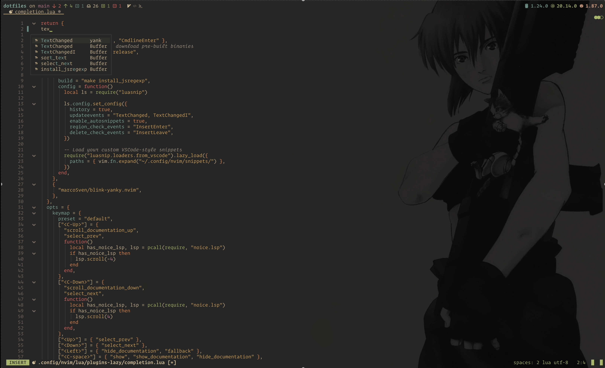

# blink-cmp-yanky

`blink-cmp-yanky` is a Neovim Lua plugin that provides a smart yank history completion source for the [blink.cmp](https://github.com/blink-cmp/blink-cmp) completion framework. It enables you to quickly access and insert your clipboard history from [yanky.nvim](https://github.com/gbprod/yanky.nvim), improving your editing workflow with seamless integration and customizable filtering.

---

## Features

- Access your [yanky](https://github.com/gbprod/yanky.nvim) history as completion suggestions.
- Filter yanks by minimum length and current filetype.
- Customize trigger characters for completion activation.

---

## Demo

[](https://github.com/user-attachments/assets/aa4da972-21e1-4368-958c-6f27777fa3d9)

---

## Installation

Use your preferred plugin manager to install:

```lua
-- Example using lazy.nvim

{

  "saghen/blink.cmp",
  dependencies = {
    { "marcoSven/blink-cmp-yanky", },
  },
  opts = {
    sources = {
      default = { "lsp", "path", "buffer", "snippets", "yank" },
      providers = {
        yank = {
          name = "yank",
          module = "blink-yanky",
          opts = {
            minLength = 5,
            onlyCurrentFiletype = true,
            trigger_characters = { '"' }, -- default is no trigger character
          },
        },
      },
    },
  },

```


| Option                | Type    | Default | Description                                          |
| --------------------- | ------- | ------- | ---------------------------------------------------- |
| `minLength`           | integer | `3`     | Minimum length of yank text to include               |
| `onlyCurrentFiletype` | boolean | `false` | Filter yanks to only those matching current filetype |
| `insert`              | boolean | `true`  | Automatically insert the selected completion text    |
| `trigger_characters`  | table   | `{}`    | Characters that trigger completion (optional)        |


## Usage

Once configured, as you type or invoke completion in Neovim, your yanky history matching the criteria will be presented as completion suggestions. Selecting one inserts the text from your register.

## Development & Contribution

Contributions and issues are welcome! Feel free to open issues or pull requests for bugs, feature requests, or improvements.

## License

MIT License © [marcoSven]
